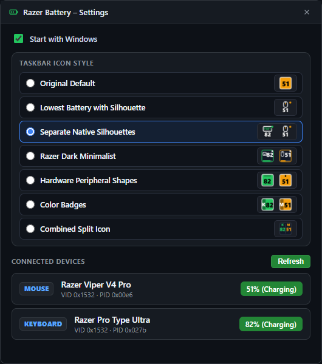
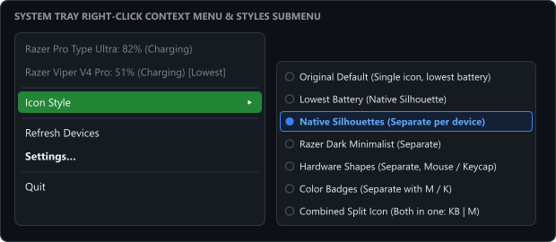

# Razer Tray Battery (Enhanced Edition)

[](https://microsoft.com/windows)
[](https://www.razer.com/synapse-4)
[]()
[](https://opensource.org/licenses/ISC)

An enhanced, modern, and lightweight Windows system tray application for real-time battery monitoring across **all** your wireless Razer peripherals simultaneously.

This enhanced edition significantly extends the original project by introducing full multi-device tracking, seamless compatibility with the new **Razer Synapse 4**, 7 customizable taskbar icon styles with live previews, a sleek frameless settings interface, and quick switching right from the tray context menu.

Works both **standalone** (via direct WebUSB HID communication) and **in tandem with Razer Synapse 4** running in the background.

---

## 🌟 What's New in this Version

- ⚡ **Simultaneous Multi-Device Monitoring**: Unlike previous versions that only tracked a single peripheral, you can now monitor multiple Razer devices at the same time (e.g. keyboard + mouse + headset) with dedicated independent icons or smart grouped displays.
- 🔄 **Razer Synapse 4 Dual-Engine Architecture**: Solves USB access conflicts when Synapse is running by introducing a real-time Synapse 4 log parser for instantaneous, zero-latency battery updates, alongside low-level direct WebUSB HID fallback when Synapse is closed.
- 🎨 **7 Custom Taskbar Display Styles**: Choose how your battery levels appear in your Windows tray — from clean Windows 11-native transparent silhouettes to compact dual-device split indicators and glowing Razer dark-mode cards.
- 🖼️ **Live Visual Style Previews**: The settings dialog features real rendered preview thumbnails for each style so you can see exactly how icons will look on your taskbar before selecting them.
- 🪟 **Modern Frameless UI**: Clean, custom-designed dark settings window without standard Windows titlebar clutter, featuring a draggable header and an integrated in-UI close button.
- 🖱️ **Context Menu Style Picker**: Switch between any of the 7 visual styles on the fly directly from the right-click tray context menu without opening the settings window.
- 🛡️ **Intelligent Receiver Deduplication**: Prevents duplicate tray icons caused by multi-interface wireless receivers, Bluetooth dual-modes, and high-frequency HyperPolling Dongles.

---

## 📸 Screenshots

### Custom Frameless Settings UI


### System Tray Context Menu & Live Style Selector


### 7 Available Taskbar Icon Styles


---

## ✨ Available UI Styles

1. **Original Default (`lowest_classic`)**: Single tray icon showing only the lowest battery level with the classic colored rounded square.
2. **Lowest Battery with Silhouette (`lowest_silhouette`)**: Single space-saving icon with the native hardware silhouette of whichever device has the lowest battery.
3. **Separate Native Silhouettes (`silhouettes`)** *(Default)*: Clean, transparent Windows-native silhouettes for each peripheral with battery color accents and battery level numbers underneath.
4. **Razer Dark Minimalist (`dark`)**: Dark carbon plates with glowing neon borders and bottom micro battery level bars.
5. **Hardware Peripheral Shapes (`shapes`)**: Ergonomic mouse silhouette with scroll notch and 3D mechanical keycap.
6. **Color Badges (`badges`)**: High-contrast solid color badges with dark tabs and bold device initials (`K`, `M`, `H`).
7. **Combined Split Icon (`combined`)**: Single space-saving icon split in two showing both devices simultaneously (`KB 82 | M 51`).

---

## 🖱️ Supported Hardware

Tested and verified on:
- **Razer Viper V4 Pro** (including White Edition & HyperPolling Dongles)
- **Razer Pro Type Ultra**
- **Razer DeathAdder / Basilisk / Naga / Cobra / Orochi / Mamba** wireless series
- **Razer BlackWidow / Huntsman / DeathStalker** wireless series
- **Razer BlackShark / Barracuda / Kraken** wireless headsets
- And all standard Razer battery-powered peripherals.

---

## 🚀 Getting Started

### Prerequisites
- Node.js (v18 or newer recommended)
- Windows 10 or 11

### Installation & Run
```bash
git clone https://github.com/imnomad/RazerTrayBattery.git
cd RazerTrayBattery
npm install
npm start
```

### Compiling Executable / Installer
To generate a standalone setup installer using Electron Forge:
```bash
npm run make
```
The resulting installer will be located in the `out/make` directory.

---

## ⚙️ Configuration

Settings are stored in `%LOCALAPPDATA%\RazerTrayBattery\config.json`:
```json
{
  "style": "silhouettes"
}
```

---

## 📜 License & Credits

This project is licensed under the ISC License.
Based on the original repository by [jozefwitek](https://github.com/jozefwitek/RazerTrayBattery).
