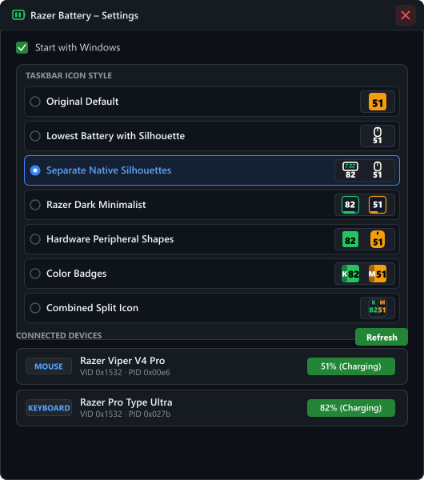
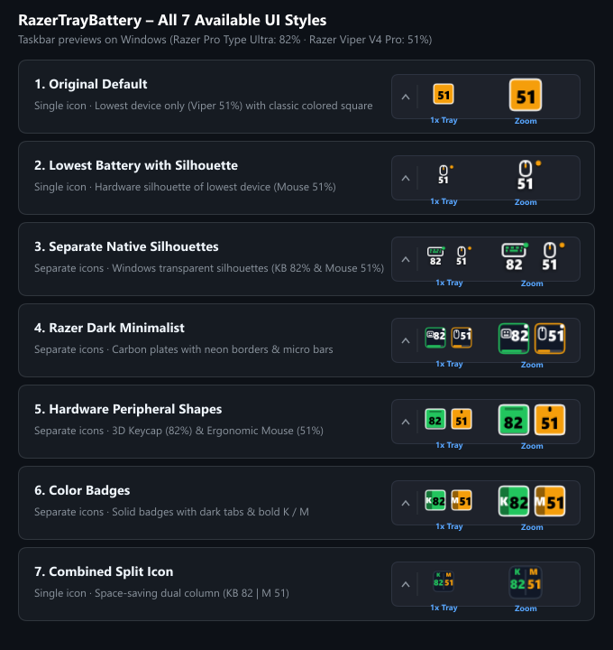

# Razer Tray Battery

An enhanced, lightweight Electron tray application for monitoring real-time battery levels of all your Razer wireless devices directly from the Windows taskbar.

Works both **standalone** (via direct WebUSB HID communication) and **seamlessly with Razer Synapse 4** running in the background.

---

## 📸 Screenshots

### Custom Frameless Settings UI


### 7 Available Taskbar Icon Styles


---

## ✨ Features

- **Simultaneous Multi-Device Monitoring**: Monitor keyboards, mice, headsets, gamepads, and other Razer peripherals at the same time with separate or combined tray icons.
- **7 Interchangeable Taskbar UI Styles**:
  1. **Original Default**: Single tray icon showing only the lowest battery level with the classic colored rounded square.
  2. **Lowest Battery with Silhouette**: Single icon with the native hardware silhouette of whichever device has the lowest battery.
  3. **Separate Native Silhouettes** *(Default)*: Clean, transparent Windows-style silhouettes for each peripheral with battery color accents.
  4. **Razer Dark Minimalist**: Dark carbon plates with glowing neon borders and bottom micro battery level bars.
  5. **Hardware Peripheral Shapes**: Ergonomic mouse silhouette with scroll notch and 3D mechanical keycap.
  6. **Color Badges**: High-contrast solid color badges with dark tabs and bold device initials (`K`, `M`, `H`).
  7. **Combined Split Icon**: Single space-saving icon split in two showing both devices simultaneously (`KB 82 | M 51`).
- **Real-Time Style Switching**: Switch styles on the fly directly from the tray context menu or through the Settings window. Preferences are automatically saved in `config.json`.
- **Razer Synapse 4 & WebUSB Dual Engine**:
  - Automatically parses Synapse 4 state logs in real time when Synapse is active.
  - Falls back to low-level direct WebUSB HID requests when Synapse is closed.
- **Sleek Frameless Window**: Native Windows titlebar is replaced with a custom dark draggable header and integrated close button.
- **Smart Device Deduplication**: Canonical hardware identification prevents duplicate tray icons for multi-interface wireless receivers (e.g., HyperPolling Wireless Dongles).
- **Windows Autostart Support**: Toggle start with Windows with one click.

---

## 🖱️ Supported Hardware

Tested and verified on:
- **Razer Viper V4 Pro** (including White Edition & HyperPolling Dongles)
- **Razer Pro Type Ultra**
- **Razer DeathAdder / Basilisk / Naga / Cobra / Orochi / Mamba** wireless series
- **Razer BlackWidow / Huntsman / DeathStalker** wireless series
- **Razer BlackShark / Barracuda / Kraken** wireless headsets
- And all standard Razer battery-powered peripherals.

---

## 🚀 Getting Started

### Prerequisites
- Node.js (v18 or newer recommended)
- Windows 10 or 11

### Installation & Run
```bash
git clone https://github.com/imnomad/RazerTrayBattery.git
cd RazerTrayBattery
npm install
npm start
```

### Compiling Executable / Installer
To generate a standalone setup installer using Electron Forge:
```bash
npm run make
```
The resulting installer will be located in the `out/make` directory.

---

## ⚙️ Configuration

Settings are stored in `%LOCALAPPDATA%\RazerTrayBattery\config.json`:
```json
{
  "style": "silhouettes"
}
```

Available styles:
- `lowest_classic`
- `lowest_silhouette`
- `silhouettes`
- `dark`
- `shapes`
- `badges`
- `combined`

---

## 📜 License

This project is licensed under the ISC License.
Based on the original repository by [jozefwitek](https://github.com/jozefwitek/RazerTrayBattery).
